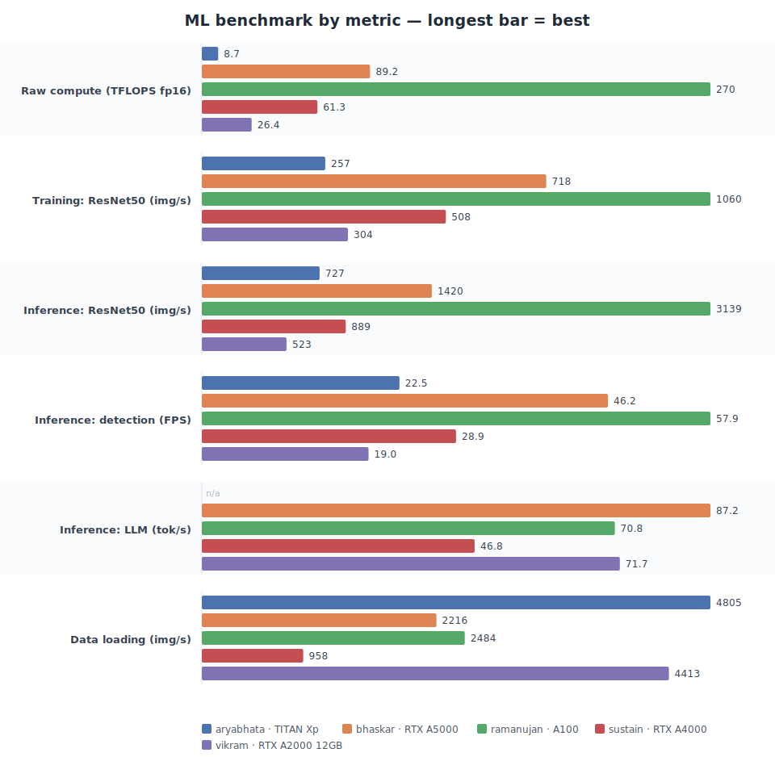

<head>

</head>

## Computational Resources

IIT Gandhinagar has a number of computational resources available for research and teaching purposes. In addition, the department also has a number of workstations available for students and faculty members.

The following is the list of computational resources in our lab apart from the institute and departmental resources.

### Servers
Our servers are named after great mathematicians/scientists, plus Sustain after the lab's focus on sustainability:

- Ramanujan (रामानुजन): Srinivasa Ramanujan made groundbreaking contributions to number theory.
- Bhaskar (भास्कर): Bhaskar (aka Bhaskar II) is known for his work Siddhānta Shiromani (सिद्धांत शिरोमणि) which includes advances in algebra, calculus, and astronomy.
- Sustain: named after the lab's focus on sustainability and energy research.

<table>
    <tr>
        <th width=25%></th>
        <th width=25%>Ramanujan</th>
        <th width=25%>Bhaskar</th>
        <th width=25%>Sustain</th>
    </tr>
    <tr>
        <td>RAM</td>
        <td>512 GB (16 x 32GB)</td>
        <td>256 GB (4 x 64GB)</td>
        <td>192 GB (6 x 32GB)</td>
    </tr>
    <tr>
        <td>CPU</td>
        <td>AMD EPYC 7452 32-Core Processor @ 2.30 GHz</td>
        <td>Intel Gold ICX 6326 @ 2.90 GHz</td>
        <td>Intel(R) Xeon(R) Silver 4208 CPU @ 2.10GHz</td>
    </tr>
    <tr>
        <td>Storage</td>
        <td>8 TB</td> 
        <td>5 TB</td>
        <td>2 TB</td>
    </tr>
    <tr>
        <td>Number of CPUs</td>
        <td>64</td> 
        <td>32</td>
        <td>16</td>
    </tr>
    <tr>
        <td>GPU</td>
        <td>4 x NVIDIA A100-SXM4 (80GB)</td>
        <td>2 x NVIDIA RTX A5000 (24GB)</td>
        <td>2 x NVIDIA RTX A4000 (16GB)</td>
    </tr>
    <tr>
        <td>Total VRAM</td>
        <td>320 GB</td>
        <td>48 GB</td>
        <td>32 GB</td>
    </tr>
</table>

 

<!-- ### Ramanujan

| | |
| -- | -- |
| RAM | 512 GB (32 x 16) |
| CPU | AMD EPYC 7452 32-Core Processor |
| Number of CPUs | 64 |
| GPU | NVIDIA A100-SXM4 (80 GB) |
| Number of GPUs | 4 |

### Sustain

| | |
| -- | -- |
| RAM | 192 GB (32 x 6) |
| CPU | Intel(R) Xeon(R) Silver 4208 CPU @ 2.10GHz |
| Number of CPUs | 16 |
| GPU | NVIDIA RTX A4000 (16Gb) |
| Number of GPUs | 2     | -->

### Workstations

Our workstations are named after Indian scientists: **Aryabhata** (आर्यभट), well-known for the concept of zero (शून्य) and the place value system, and **Vikram**.

<table style="width:75%;">
    <tr>
        <th style="width:25%;"></th>
        <th style="width:25%;">Aryabhata</th>
        <th style="width:25%;">Vikram</th>
    </tr>
    <tr>
        <td>RAM</td>
        <td>32 GB</td>
        <td>64 GB</td>
    </tr>
    <tr>
        <td>CPU</td>
        <td>Intel Core i9-13900</td>
        <td>Intel Core i9-14700</td>
    </tr>
    <tr>
        <td>Storage</td>
        <td>2 TB</td>
        <td>4 TB</td> 
    </tr>
    <tr>
        <td>Number of CPUs</td>
        <td>24</td>
        <td>32</td> 
    </tr>
    <tr>
        <td>GPU</td>
        <td>1 x NVIDIA RTX Titan XP (12 GB)</td>
        <td>1 x NVIDIA RTX A2000 (12 GB)</td>
    </tr>
    <tr>
        <td>Total VRAM</td>
        <td>12 GB</td>
        <td>12 GB</td>
    </tr>
</table>

     

### Relative Performance

Measured with our open [gpu-benchmark-suite](https://github.com/nipunbatra/gpu-benchmark-suite) — the same Docker-based workloads on every machine, grouped into **raw compute**, **training**, **inference**, and **data-loading** so the numbers are directly comparable.

<table>
  <tr><th>Benchmark</th><th>Ramanujan</th><th>Bhaskar</th><th>Sustain</th><th>Aryabhata</th><th>Vikram</th></tr>
  <tr><td>GPU</td><td>A100-SXM4-80GB</td><td>RTX A5000</td><td>RTX A4000</td><td>TITAN Xp</td><td>RTX A2000</td></tr>
  <tr><td>Raw compute (TFLOPS, fp16)</td><td><b>269.7</b></td><td>89.2</td><td>61.3</td><td>8.7</td><td>26.4</td></tr>
  <tr><td>Training — ResNet50 (img/s)</td><td><b>1059.9</b></td><td>717.7</td><td>508.5</td><td>257.3</td><td>304.5</td></tr>
  <tr><td>Inference — ResNet50 (img/s)</td><td><b>3139.4</b></td><td>1419.5</td><td>888.6</td><td>726.9</td><td>522.7</td></tr>
  <tr><td>Inference — detection (FPS)</td><td><b>57.9</b></td><td>46.2</td><td>28.9</td><td>22.5</td><td>19.0</td></tr>
  <tr><td>Inference — LLM gen (tok/s)</td><td>70.8</td><td><b>87.2</b></td><td>46.8</td><td>—</td><td>71.7</td></tr>
  <tr><td>Data loading (img/s)</td><td>2483.8</td><td>2216.5</td><td>957.6</td><td><b>4805.0</b></td><td>4413.1</td></tr>
</table>

Raw compute (TFLOPS) and training throughput track the GPUs' real power most reliably — the A100 leads everywhere it matters. Small-batch inference (LLM tokens/sec, detection FPS) is latency-bound, so it can look flat on large GPUs and varies with concurrent load. Numbers are point-in-time, single-GPU measurements; the TITAN Xp's LLM generation is omitted as its older (Pascal) architecture is impractically slow at FP16 generation.

## Server Policy

**How to get access**: Send an email to Dr. [Supin Gopi](mailto:supin.gopi@iitgn.ac.in), keeping Prof. [Nipun Batra](mailto:nipun.batra@iitgn.ac.in) in cc. Mention the following details in your request: i) server name; ii) purpose for access.

**Don'ts**: 

- Do not use the server for personal use or anything not related to the project. This includes any classwork or homework.
- Do not share your server credentials with anyone else.

**Fair usage**:

- Sometimes we have multiple projects running on the same server. Please be considerate of other projects and do not use up all the resources.
- Sometimes we may allocate specific cores or GPUs to specific projects. Please do not use cores or GPUs that are not allocated to your project.