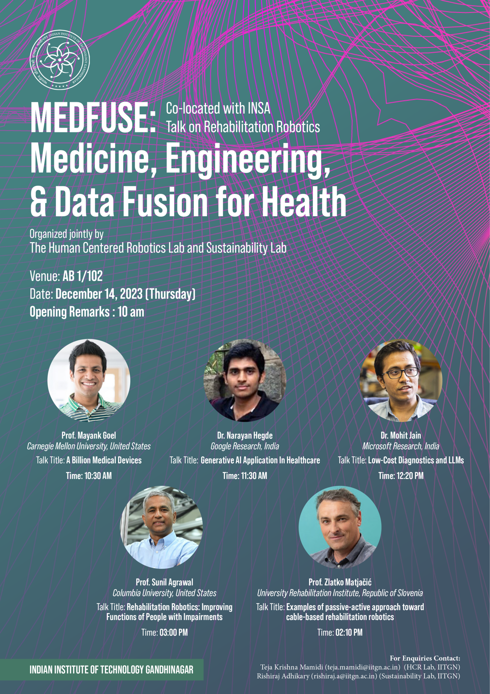

In this page, we include the events that we have organized or co-organized.

## 2025
ACM India Summer School on AI for Social Good
Link: [ACM India Summer School 2025](https://sustainability-lab.github.io/acm-summer-2025/)
{loading="lazy"}

## 2023

MEDFUSE: Medicine, Engineering, and Data Fusion for Health

{loading="lazy"}
