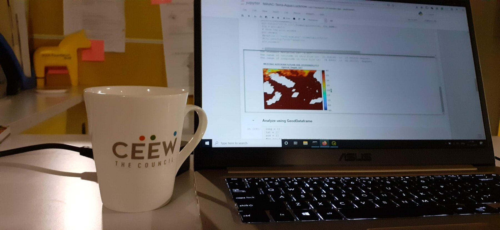
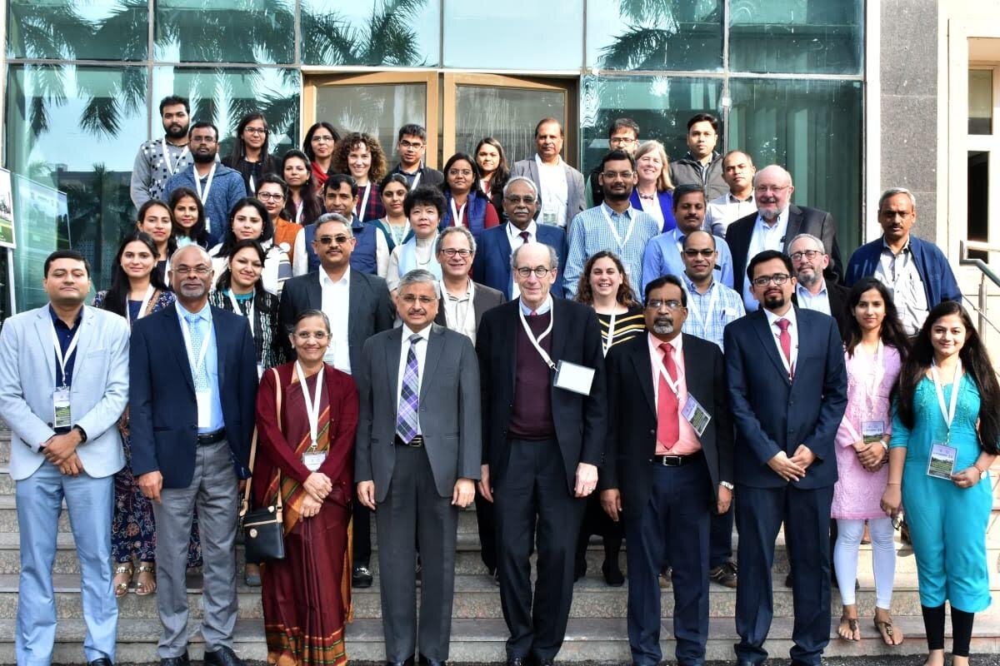
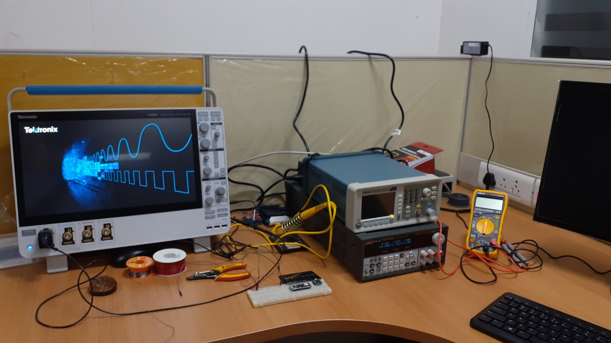
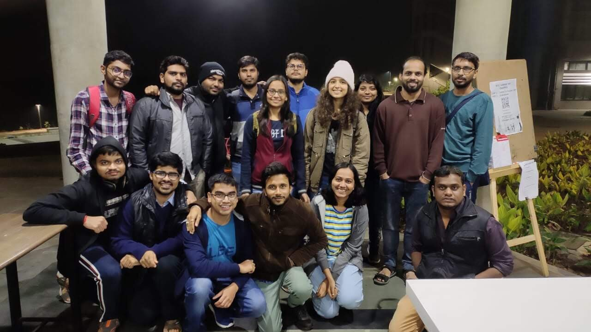

### About me

I am Rishiraj Adhikary, the Sustainability Lab's first PhD graduate. I am now a Postdoctoral Research Associate at the University of Cambridge. This is the story of how I got here — and how much of it I owe to the lab and its people.

My dream was to study at an IIT, renowned for its top-notch technical education. Like countless others, I did not secure admission during my undergraduate studies. So I went from Shillong to Guwahati and earned a BTech in Electronics Engineering from Gauhati University, after which I joined an IT firm. Then, one afternoon in the office, one thing led to another and I felt I should give an IIT another shot — this time for an MTech. My mother encouraged me to attempt postgraduate study at an IIT, so I moved back to Shillong to prepare for GATE. I worked diligently and qualified the exam, but my score still fell short of the marks required for IIT admission. Despite this, I firmly believe that hard work pays off.

During a brief stint at IIIT Sricity, I met Dr. Venkatesh Vinayakarao (a former colleague of Prof. Nipun at IIIT Delhi), who encouraged me to join an IIT as a research assistant so I could experience high-quality research firsthand. Eager to do so, I sent cold emails to several professors across the IITs. On February 4, 2019, after an online interview, I received an offer from Prof. Nipun Batra to work in his lab for three months.

### The first day and beyond

On my first day, Prof. Nipun asked one of his undergraduate students, Deepak, to give me a tour of the campus. Along the way I met other UG students like Soham, and PG students Karan and Souvik. The atmosphere they created was warm and jovial, and as an introvert I felt genuinely welcome. Little did I know how much I would end up learning from these UG and PG colleagues. During group meetings, Deepak's careful feedback sharpened how I understood a concept, and Soham was remarkable at almost everything — from hardware to web design to implementing machine-learning algorithms from scratch.

### The first three months (March – June 2019)

My BTech in Electronics gave me solid experience with microcontrollers and sensors, so Prof. Nipun asked me to build a sensing system for the Water Treatment Plant at IIT Gandhinagar. Beyond the technical work, this let me meet the wonderful people who keep the campus running — like Vishnu Deth and Jyotish Kumar — who patiently explained how such a large campus receives, filters, and distributes its water. It was my first experience collaborating with the people who look after a critical campus asset.

After just two months, Prof. Nipun brought me into writing a research paper. He shared a draft in Google Docs full of pointers and asked me to fill in each section — explaining the experiments and data collection, and supporting every claim with a graph. That exercise taught me to make presentable figures, run efficient experiments, and document every task properly. Much of what I learned in this phase became the foundation of my PhD.

{loading="lazy"}

The weekly group meetings were an integral part of lab life. I met wonderful students — Deepak, Apoorv, Soham, Rithwik, Karan, Souvik — and learned something from each of them.

{loading="lazy"}

Near the end of those two months, Prof. Nipun asked whether I would be interested in pursuing a PhD. I was elated — I really wanted to spend more time at IIT Gandhinagar. My biggest fear was the PhD interview, and when I shared it, he reassured me: "Don't worry — even if you don't clear the interview, I will extend your JRF tenure and you can continue here." That one sentence gave me the confidence to face it, and he went further, taking a mock interview to prepare me for the real one. Getting into the PhD program was one of the happiest days of my life.

### The first year of the PhD (July 2019 – July 2020)

My excitement soon met the weight of coursework. Prof. Nipun reminded me that coursework is an integral part of learning and helps keep the mind engaged beyond research — which turned out to be true. Along the way I met many new people, and my circle on campus grew.

Then, after a semester and a couple of months on campus, COVID struck. Like many others, we moved back home amid the uncertainty. Prof. Nipun set up steady timelines, and at one point we met daily over Zoom to share progress. Meeting every day felt like a lot back then, but it was precisely those regular check-ins that got me my first publication. In the early PhD years we don't yet appreciate how much effort a paper takes; during this time I had the chance to work with Prerna, Tanmay, and — for the first time — my own labmate, Zeel. All of them are in wonderful places today, and I am so glad to have this global network of friends.

{loading="lazy"}

### The second year: rejections, and a turning point

Back on campus between periodic lockdowns, I was working steadily on a second project, SpiroMask. It took about 2.5 years for that work to finally be published, and every rejection stung — I had poured so much into it, including collecting breathing data while COVID was still a real concern.

I still remember the third rejection of the SpiroMask paper; it was the moment I felt closest to giving up. Rather than dwell on the setback, Prof. Nipun turned it into action — he began looking up fellowships I could apply to, hoping some good news might lift the mood. He found that the Fulbright fellowship application was still open, with about a week left to submit. I told him I shouldn't bother, since it was so competitive I would never get it. His reply has stayed with me: "Do not self-reject — let them reject you first. Self-doubt shouldn't stop us from applying."

I eventually found the courage to apply. There was another hurdle: the application needed a letter of invitation from a US institution. I drafted one myself, Prof. Nipun emailed it to two labs in the US, and within 24 hours both replied with invitations. I remember standing in the Firpeal hostel lift when I saw his email carrying the invitation — that was all I needed to feel motivated again. It was proof that the work wasn't in vain, and that some things simply need a little holding on. By October 2021, I was one of 30 recipients of the fellowship, and a few days later I also received the PMRF fellowship. Things were turning around, and the motivation to work harder came right back.

{loading="lazy"}

### The third year: balancing teaching and research

Being a teaching assistant is an important part of a PhD, and most of the time it is genuinely rewarding. During one busy stretch in 2022, though, my teaching responsibilities began to overlap with a major paper deadline, and I was struggling to balance both. When Prof. Nipun noticed, he stepped in and helped rearrange my assignment so I could focus on the submission. It is exactly the kind of support that goes beyond research — making sure a student's wellbeing and work don't suffer — and it made a timely submission possible.

### Five years is not only about research

When I returned to campus after my Fulbright tenure, I grew a little complacent and drifted for almost a month. Prof. Nipun nudged me to get back to work and resume meetings with my CMU advisor, Prof. Mayank Goel. A PhD is a grind, and five years is very little time to learn to do research, present, write, collect data, network, attend conferences, intern, and — most importantly — publish in good venues. These were hard skills to build, especially with no research training in my undergraduate years, and training me took a tremendous, often invisible amount of effort from Prof. Nipun. As he likes to say, hard work isn't about arriving at the lab at 5 AM and leaving at 11 PM — it's about giving even two solid, focused hours to research.

### So close, yet so far

By the end of my PhD, I realized I had achieved far more than I ever dreamed of. On my first day I had simply prayed to spend as much time as possible at the institute and earn a doctorate. I got much more in return: multiple fellowships, a great network, and a mentor I think of as an elder brother. I sometimes joke to friends that, given my introverted and sensitive nature, I might not have completed a PhD with anyone else — this lab changed me for the better.

That lesson came with its challenges. In my last semester I found it hard to land a job; while others told me I had a strong profile, I couldn't quite carry that into interviews. Prof. Nipun connected me with people in his network, and it eventually worked out — I joined JioThings as a Research Scientist. This was also when AI and LLM research were reshaping most labs. I had long held the view that I would only *use* AI to advance my real interest in ubiquitous health sensing, never work *on* it. That was naive, and it took me over a year to accept a simple truth: sometimes research directions need to pivot. The LLM experience I gained at Reliance later proved instrumental in my postdoc applications.

### Research goes on

The Sustainability Lab changed my life. I came to earn a PhD from an IIT — that was my dream — and I left with far more than I had hoped for. Beyond the fellowships and the papers, I became a better person: more empathetic, more practical. I have recently joined the University of Cambridge as a Postdoctoral Research Associate, carrying every one of these lessons with me, and I hope to live up to what Prof. Nipun taught me.
