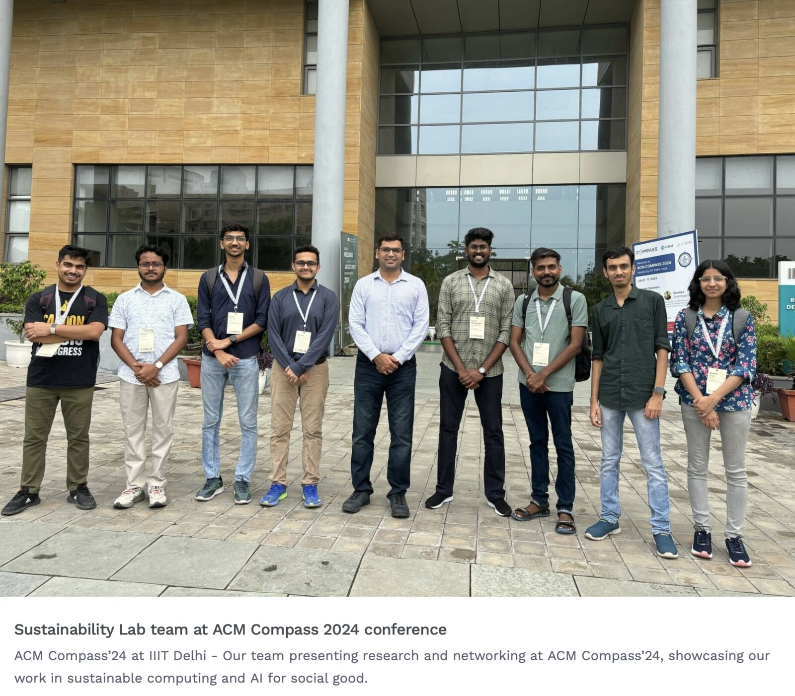

# About Me

Hi! I’m Vannsh Jani. I will be graduating with a B.Tech degree in Computer Science and Engineering in 2026. I had the incredible opportunity to work at the Sustainability Lab for a year during my sophomore year, and looking back, it completely reshaped who I am as a person and as a researcher.

When I first joined, my initial task was working on a project focused on Machine Learning visualizations. I was tasked with creating blogs and interactive applications to visualize core mathematical concepts behind ML. While it wasn’t direct academic research yet, this project forced me to build rock-solid fundamentals. It taught me my very first lesson about the lab: Prof. Nipun Batra values your commitment, curiosity, and passion to learn far more than what you already know on day one.

# My Views

Working with Nipun Sir has been one of the defining experiences of my undergraduate life. The amount of time and energy he invests in guiding his students (both within academics and in life or career planning in general) is commendable.

I’ve experienced firsthand his absolute dedication to his students' growth. Whenever we wrote papers, he would meticulously review our work across countless iterations, providing detailed, constructive feedback every single time. Even long after my formal tenure at the lab ended, Sir continued to offer his support, mentorship, and invaluable guidance when I was navigating my master's applications. I will always remain deeply grateful for his constant presence as a mentor.

# Research That Leaves the Lab

After the visualizations project, I stepped into actual computer vision research, working on detecting brick kilns from satellite imagery. This project was a massive eye-opener for me regarding how real-world research operates.

> One of the most fulfilling feelings as an undergrad was realizing that the work we do here actually leaves the lab. Over time, I’ve received unexpected emails from people outside the institute using the live brick kiln detection web app I helped build. Knowing that your code and research are actively being utilized by others in the real world is an incredibly empowering feeling.

Our efforts eventually led to a research poster being accepted at ACM COMPASS 2024, which we traveled to present in-person in Delhi.

{loading="lazy"}

# Overcoming the Initial Intimidation

I'll be honest, when I started doing research, I felt heavily intimidated. I was just a second-year undergraduate surrounded by senior undergrads, experienced Master’s students like Suraj and Shataxi, and brilliant PhD candidates like Zeel and Rishabh. I worried that my ideas wouldn't measure up.

However, the lab culture completely shattered that fear. The environment is structured so beautifully that everyone is encouraged to speak up, pitch ideas, and brainstorm together, regardless of whether you are the first author or the youngest person in the room. Working alongside Rishabh, Zeel, and the rest of the team taught me how to approach problems from absolute fundamentals and constantly question our underlying assumptions.

# Values Learnt

Beyond coding and writing papers, the Sustainability Lab teaches you resilience. I vividly remember how hard Sir encouraged us to work during paper rebuttals. We would grind through multiple iterations to improve our work. Even when a paper didn't get accepted immediately, that rigorous process significantly boosted our ratings and refined the work, giving it a much stronger foundation for its next submission. It taught me that rejections aren’t dead ends, they are just iterations toward a better version.

My time at the Sustainability Lab sparked a deep, lasting passion for Computer Vision and generative modeling, ultimately driving me to pursue a full-time research career. To anyone considering joining: if you are willing to show up, work hard, and stay curious, this lab will give you the wings to go anywhere you want.
