

<strong>PhD Positions Available:</strong> We are actively looking for strong PhD students to work on AI for sustainability. <a href="openings.qmd">Learn more and apply</a>

<h1>Sustainability Lab</h1>

AI-driven research for a sustainable future

<a href="openings.qmd" class="hero-btn primary">Join Us</a>
<a href="papers/index.qmd" class="hero-btn secondary">Our Research</a>
<a href="flyer.pdf" class="hero-btn secondary" target="_blank">Lab Flyer</a>

## Research

Projects at the intersection of AI and sustainability

Explore by area:

<a href="projects.html?tag=air-quality" class="home-tag-link">Air Quality</a>
<a href="projects.html?tag=health-sensing" class="home-tag-link">Health Sensing</a>
<a href="projects.html?tag=nilm" class="home-tag-link">NILM</a>
<a href="projects.html?tag=computer-vision" class="home-tag-link">Computer Vision</a>
<a href="projects.html?tag=machine-learning" class="home-tag-link">Machine Learning</a>
<a href="projects.html" class="home-tag-link all-projects">All Projects</a>

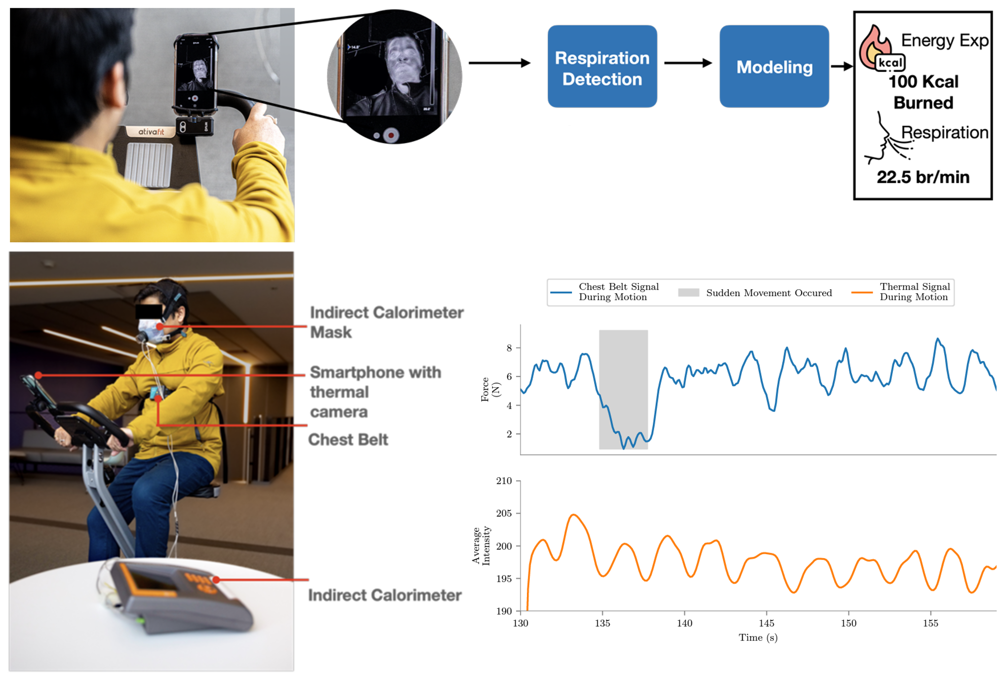

<h3>JoulesEye</h3>

Energy expenditure estimation and respiration sensing from thermal imagery during exercise.

Health Sensing
Thermal Imaging
AI/ML

<a href="https://sustainability-lab.github.io/jouleseye/" class="project-link">Learn more</a>

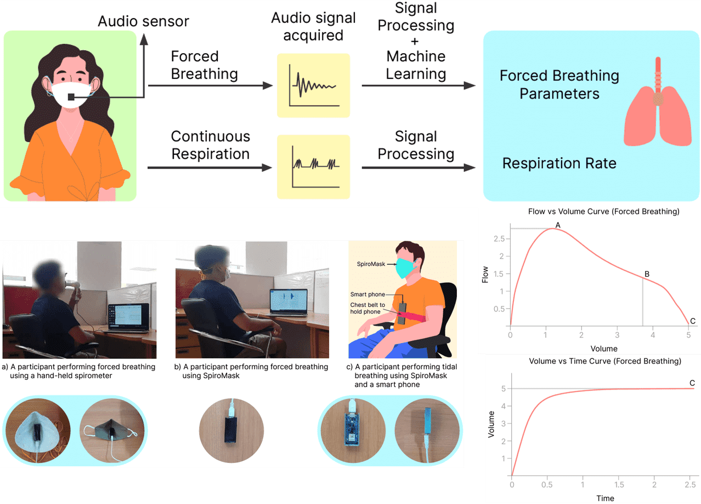

<h3>SpiroMask</h3>

Smart respiratory monitoring system transforming regular face masks into health sensing devices.

Healthcare
IoT
Respiratory Health

<a href="https://dl.acm.org/doi/fullHtml/10.1145/3570167" class="project-link">Learn more</a>

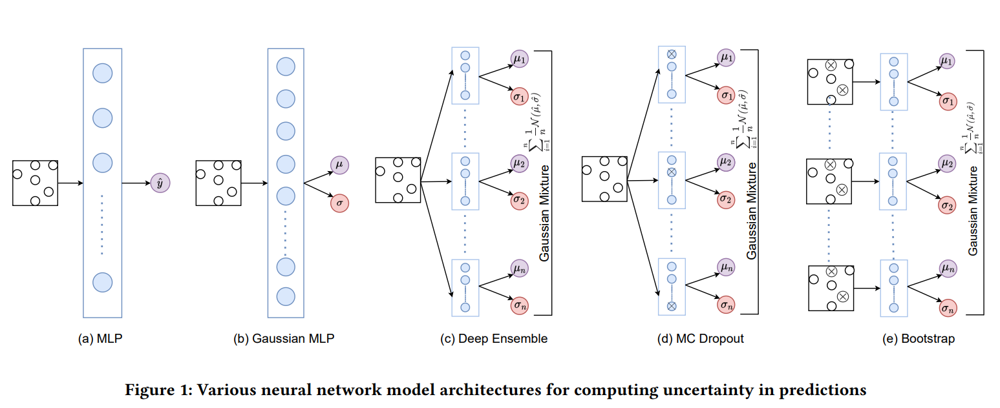

<h3>"I do not know"</h3>

Quantifying Uncertainty in Neural Network Based Approaches for Non-Intrusive Load Monitoring

NILM
Machine Learning
Uncertainty

<a href="https://github.com/VibhutiBansal-11/NILM_Uncertainty" class="project-link">Learn more</a>

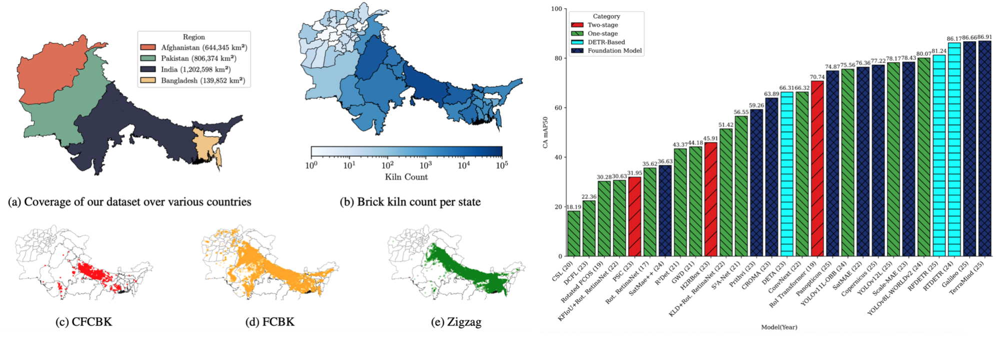

<h3>SentinelKilnDB</h3>

A Large-Scale Dataset and Benchmark for OBB Brick Kiln Detection in South Asia Using Satellite Imagery.

Computer Vision
Earth Observation

<a href="https://sustainability-lab.github.io/sentinelkilndb/" class="project-link">Learn more</a>

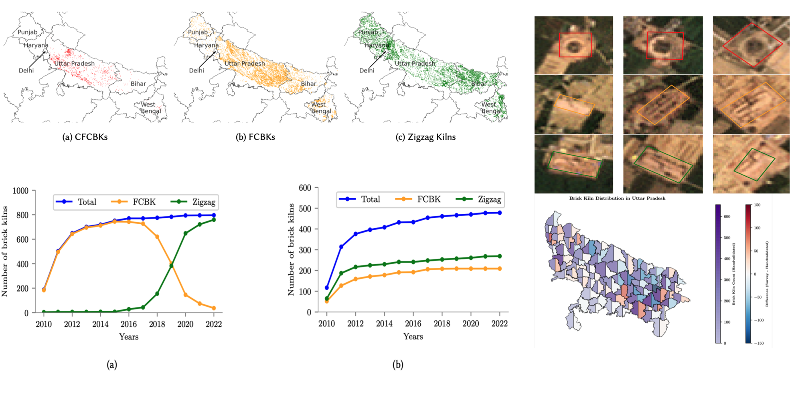

<h3>Space to Policy</h3>

Using satellite imagery and AI to monitor environmental compliance and inform policy decisions.

Satellite Data
Policy
Environmental

<a href="https://sustainability-lab.github.io/brick-kilns/" class="project-link">Learn more</a>

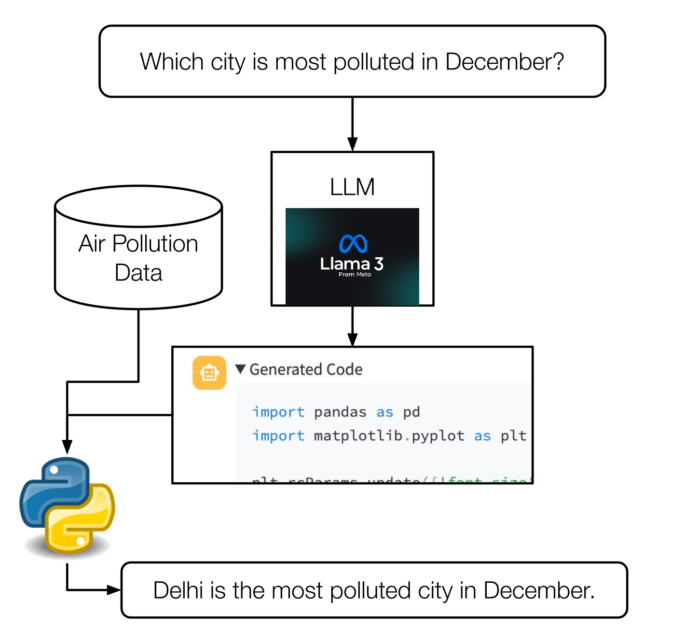

<h3>VayuBuddy</h3>

An LLM-powered chatbot system to reduce the barrier between stakeholders and air quality sensor data

Air Quality Data
Policy
Environmental

<a href="https://sustainability-lab.github.io/vayubuddy/" class="project-link">Learn more</a>

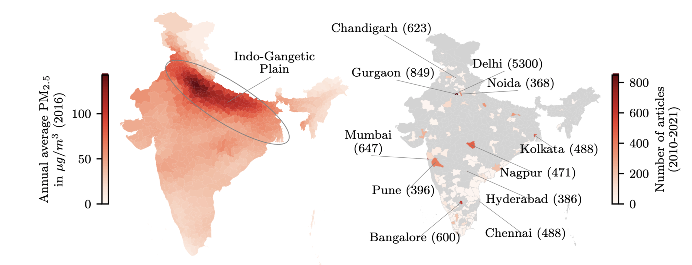

<h3>Samachar</h3>

Print News Media on Air Pollution in India — analyzing how air quality is covered in Indian print media.

Air Quality
NLP
Policy

<a href="https://github.com/karm-patel/Samachar-News-media-on-air-pollution" class="project-link">Learn more</a>

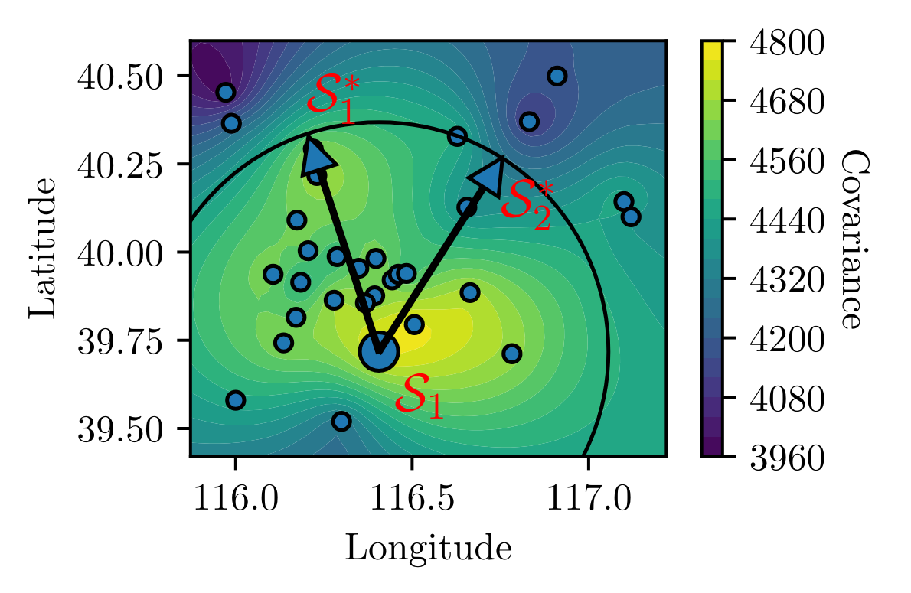

<h3>Scalable Gaussian Processes</h3>

Machine learning approach for fine-grained air quality inference using Gaussian processes at scale.

Air Quality
Machine Learning
Gaussian Processes

<a href="https://github.com/patel-zeel/AAAI22" class="project-link">Learn more</a>

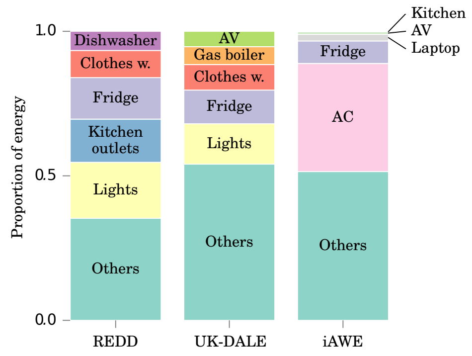

<h3>NILMTK</h3>

An Open Source Toolkit for Non-intrusive Load Monitoring — pioneering framework for energy disaggregation research.

NILM
Toolkit
Open Source

<a href="https://github.com/nilmtk/nilmtk" class="project-link">Learn more</a>

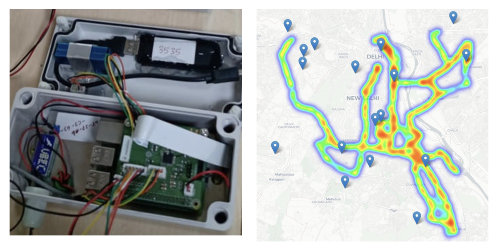

<h3>AirDelhi</h3>

A fine-grained air quality dataset from mobile sensors on Delhi buses, enabling better pollution monitoring.

Air Quality Data
Policy
Environmental

<a href="https://neurips.cc/virtual/2023/poster/73476" class="project-link">Learn more</a>

<a href="papers/index.qmd" class="hero-btn secondary">View All Publications</a>

## Funding

::: {.funder-block}
{.funder-logo}
:::

::: {.funder-block}
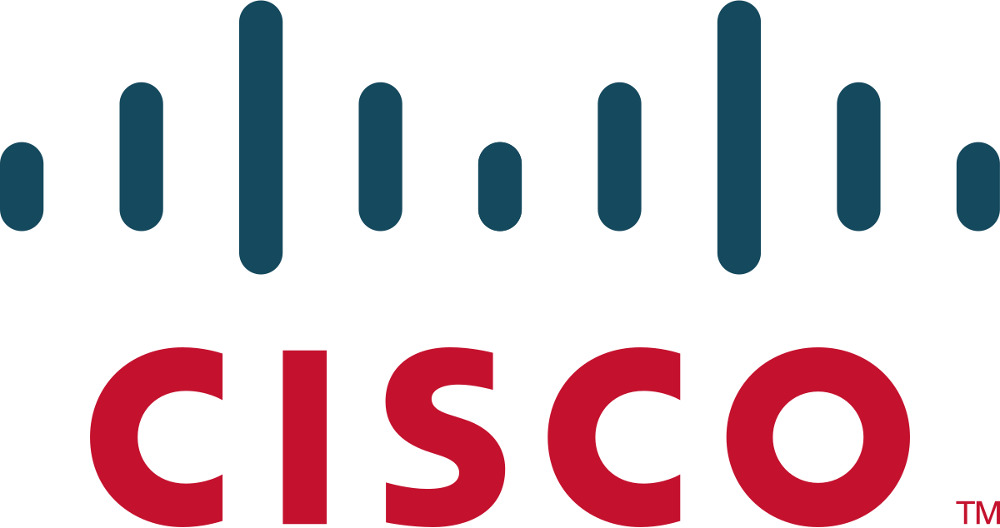{.funder-logo}
:::

::: {.funder-block}
{.funder-logo}
:::

::: {.funder-block}
{.funder-logo}
:::

::: {.funder-block}
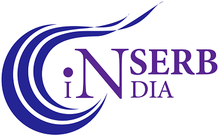{.funder-logo}
:::

::: {.funder-block}
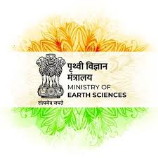{.funder-logo}
:::

::: {.funder-block}
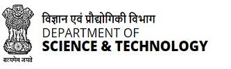{.funder-logo}
:::

::: {.funder-block}
{.funder-logo}
:::

::: {.funder-block}
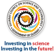{.funder-logo}
:::

::: {.funder-block}
{.funder-logo}
:::

::: {.funder-block}
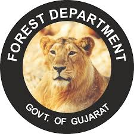{.funder-logo}
:::

::: {.funder-block}
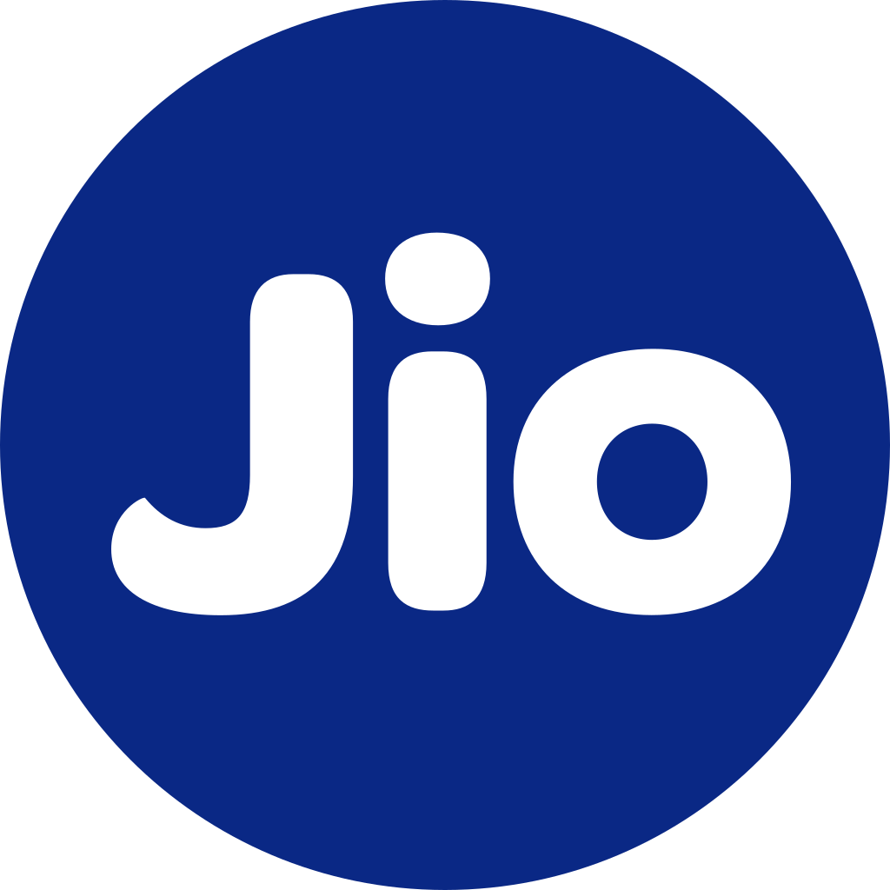{.funder-logo}
:::

## Connect

<a href="https://www.youtube.com/@SustainabilityLab-SL" target="_blank" class="hero-btn secondary">Lab YouTube</a>
<a href="https://www.youtube.com/@NipunBatra0" target="_blank" class="hero-btn secondary">Teaching YouTube</a>
<a href="https://x.com/nipun_batra" target="_blank" class="hero-btn secondary">Twitter</a>
<a href="https://www.linkedin.com/in/nipunbatra0/" target="_blank" class="hero-btn secondary">LinkedIn</a>

<h2>Join the Lab</h2>

We're looking for passionate researchers to drive innovation in sustainability through cutting-edge AI research.

<a href="openings.qmd" class="join-btn primary">View Openings</a>
<a href="upskilling.qmd" class="join-btn secondary">Research Skills Bootcamp</a>
<a href="lab_culture.qmd" class="join-btn secondary">Our Culture</a>
<a href="members.qmd" class="join-btn secondary">Meet the Team</a>

