

<h3>Meet Our Extended Family</h3>

14 current researchers to 50+ global alumni making impact worldwide

<a href="alumni.qmd" class="alumni-btn">Meet Our 50+ Alumni</a>
<a href="experiences.qmd" class="alumni-btn">Read Their Stories</a>

## Faculty

<h3>Prof. Nipun Batra</h3>

Machine Learning • Sensing Technologies • Computational Sustainability

Nipun Batra is an Associate Professor of Computer Science at IIT Gandhinagar. He completed his postdoctoral research at the University of Virginia and earned his PhD from IIIT Delhi. His research group focuses on utilizing machine learning and sensing technologies to address computational sustainability challenges, particularly in smart buildings, air quality, and healthcare.

## PhD 

::: {layout-ncol=4}

<a href="https://rishabh-mondal.github.io">
   
</a>
Rishabh Mondal (Jun 2023 - present) <em style="color: #334155; font-size: 0.85rem;">Computer Vision • Earth Observations</em>

<a href="https://ayushshrivstava.github.io/">
  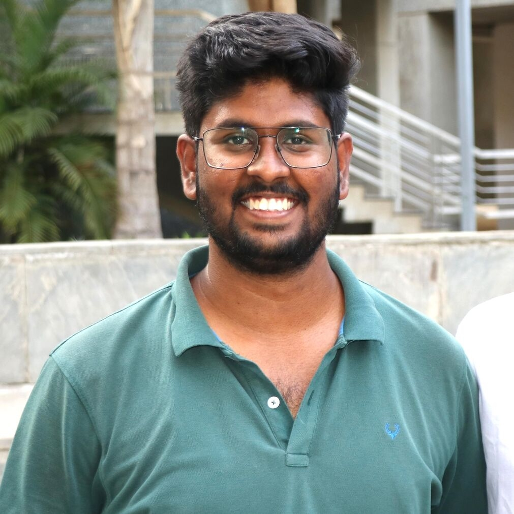 
</a>
Ayush Srivastava (Jul 2024 - present) <em style="color: #334155; font-size: 0.85rem;">Health Sensing • Respiratory Monitoring</em>

<a href="">
  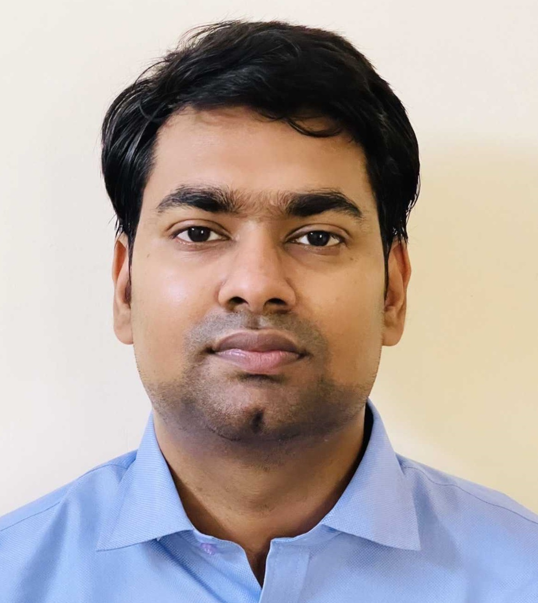 
</a>
Ujjwal K. Gupta (Jul 2024 - present) <em style="color: #334155; font-size: 0.85rem;">Satellite Data • Machine Learning</em>

:::

## MTech

::: {layout-ncol=4}

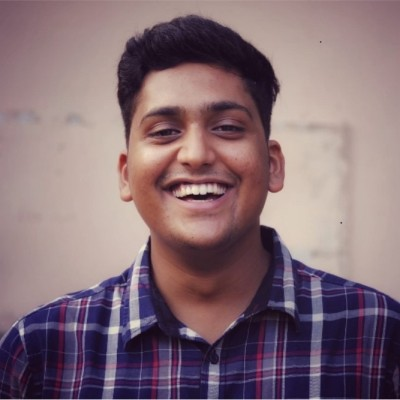 
Abhay Pisharodi (Jul 2024 - present) <em style="color: #334155; font-size: 0.85rem;">LLMs • Reasoning • Air Quality</em>

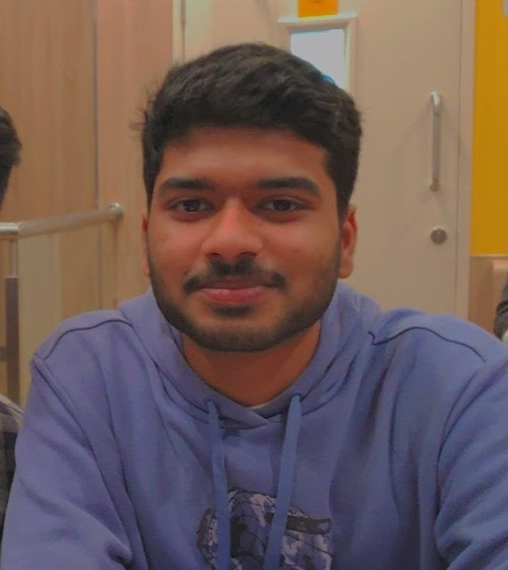 
Abhyudaya Nair (Jul 2024 - present) <em style="color: #334155; font-size: 0.85rem;">Health Sensing • Respiratory Monitoring</em>

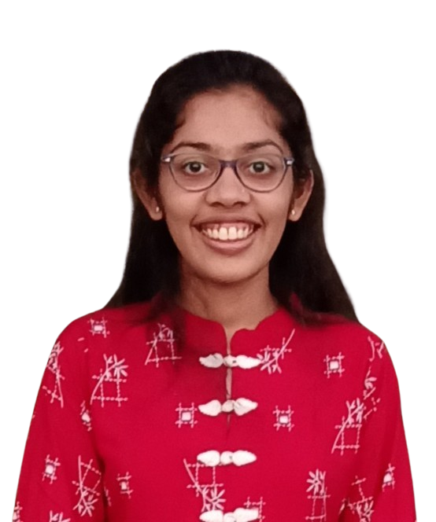 
Diya Thakor (Jul 2024 - present) <em style="color: #334155; font-size: 0.85rem;">LLMs • Air Quality</em>

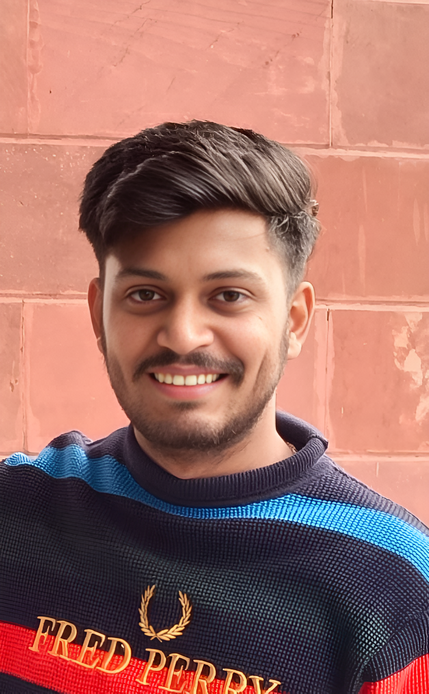 
Vinayak Rana (Jul 2024 - present) <em style="color: #334155; font-size: 0.85rem;">Air Quality • Active Learning</em>

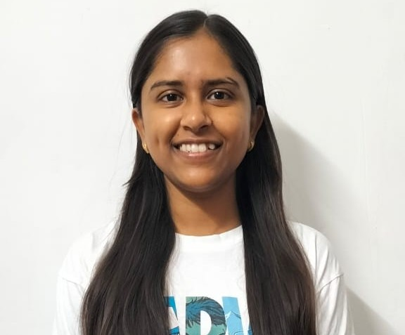 
Suruchi Hardaha (Jul 2024 - present) <em style="color: #334155; font-size: 0.85rem;">Computer Vision • Self-Supervised Learning</em>

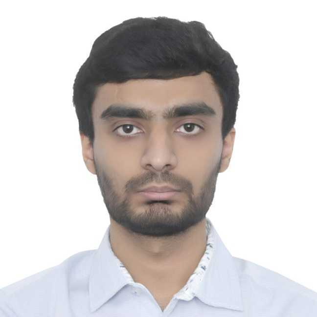 
Parv Thecker (Jul 2025 - present) <em style="color: #334155; font-size: 0.85rem;">Healthcare • IoT • Computer Vision</em>

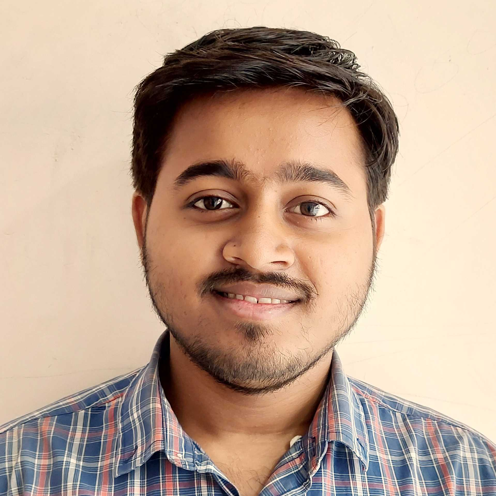 
Balbir Prasad (Jul 2025 - present) <em style="color: #334155; font-size: 0.85rem;">Physics Informed ML • AI weather forecasting</em>

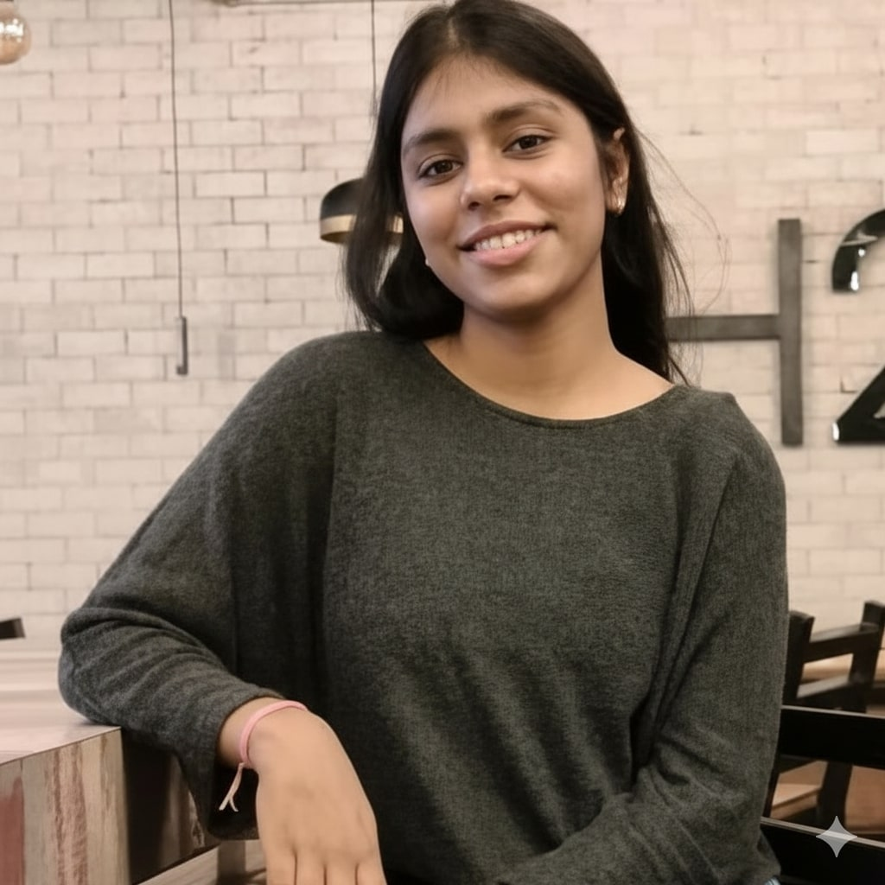 
Hemani Tekwani (Jul 2025 - present) <em style="color: #334155; font-size: 0.85rem;">Computer Vision • GeoAI</em>

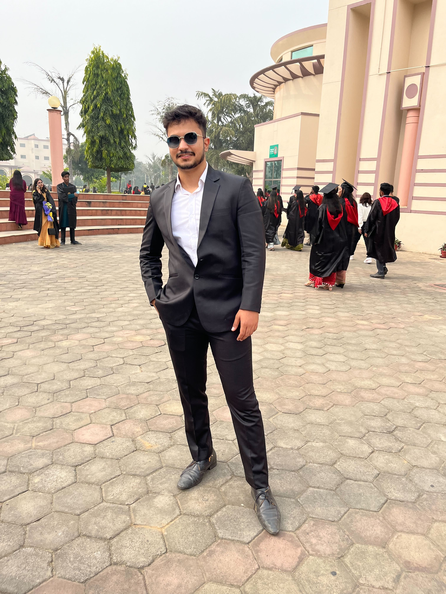 
Saaransh Shandilya (Jul 2025 - present) <em style="color: #334155; font-size: 0.85rem;">Natural Language Processing • LLMs</em>

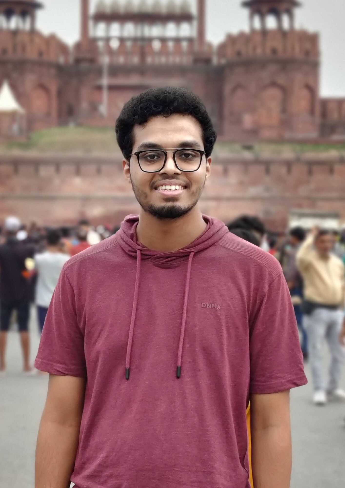 
Zayed Mudassir (Jul 2025 - present) <em style="color: #334155; font-size: 0.85rem;">VLM • Computer Vision</em>
:::

## Research Fellows

::: {layout-ncol=4}
<a href="">
  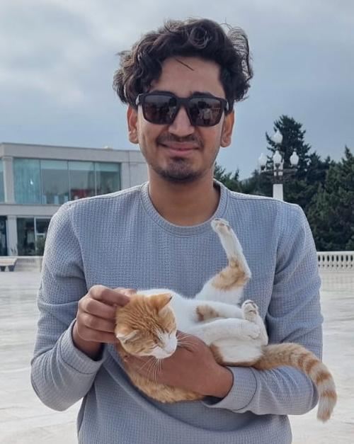 
</a>
Kirtan Gangani (Aug 2025 - present) <em style="color: #334155; font-size: 0.85rem;">Smart Energy • Time-Series Analysis</em>

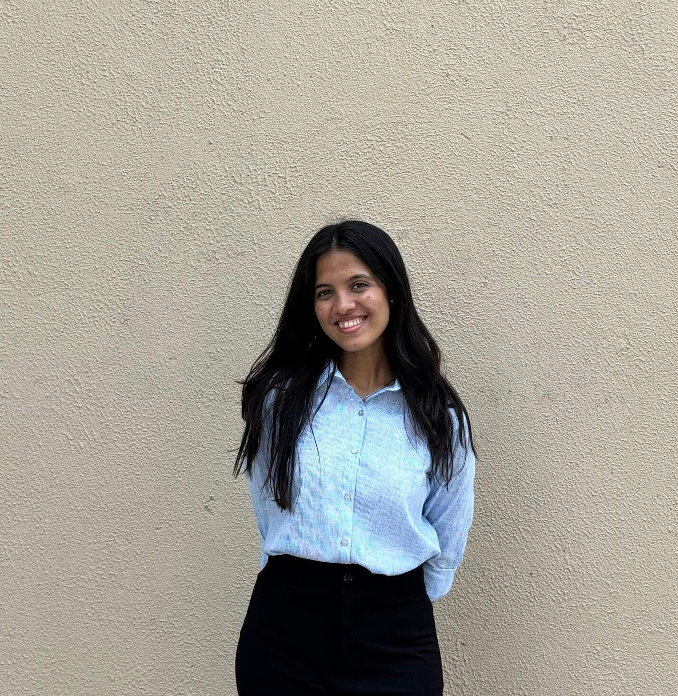 
Deena Lad (Sep 2025 - present) <em style="color: #334155; font-size: 0.85rem;">Environmental Modelling • Research Methods</em>

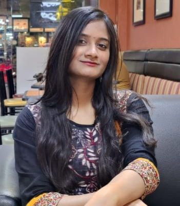 
Vaibhavi Tiwari (Feb 2026 - present) <em style="color: #334155; font-size: 0.85rem;">AI • Machine Learning</em>
:::

<h3>📸 Our Journey Together</h3>

Explore our lab's journey through years of collaboration, celebrations, and milestones. From research breakthroughs to graduation dinners, conference presentations to award ceremonies.

<a href="memories.qmd" class="hero-btn primary">View All Memories</a>

<h3>🚀 Want to Join Our Team?</h3>

We are always looking for passionate researchers to join our mission of creating a sustainable future through AI and technology.

<a href="openings.qmd" class="join-btn">View Open Positions</a>
<a href="lab_culture.qmd" class="join-btn" style="background: transparent; color: #2563eb; border: 2px solid #2563eb;">Learn About Our Culture</a>

