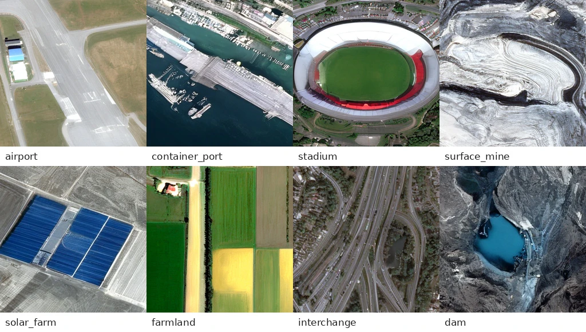

**BMVC 2026** · Digvijay Singh Parihar\*, Rishabh Mondal\*, Nipun Batra  
*Equal contribution.

[Read the paper](flowsat-bmvc2026.pdf){.btn .btn-primary}
[Project and examples](https://dsp81.github.io/flowsat-satellite-image/){.btn .btn-outline-primary}
[Code](https://github.com/sustainability-lab/flowsat-satellite-image){.btn .btn-outline-primary}
[BibTeX](../bibtex/flowsat2026.bib){.btn .btn-outline-primary}

## The problem and the idea

A satellite image comes with information about where, when and how it was acquired. FlowSat combines text with geographic location, acquisition date, ground sampling distance and cloud cover to guide satellite image synthesis.

The model builds on a pretrained SANA flow-matching Diffusion Transformer. Its metadata encoder respects the geometry of each field: locations lie on a sphere, dates are cyclic, and sensor values vary across scales. A zero-initialised conditioning branch preserves the pretrained backbone at the start of fine-tuning.

## Reported results

On fMoW-RGB, the paper reports **FID 31.10** and **CLIP score 0.3016** with **20 Euler sampling steps** at the 125K checkpoint. The compared DiffusionSat model uses 100 steps. These are sampling-step counts, not a measured end-to-end speedup.

The paper's Table 2 distinguishes a controlled DiffusionSat comparison from other published baselines, whose training data and evaluation details are not matched. The headline numbers apply to fMoW-RGB; they do not establish best performance on every dataset or metric.

## Build on it

For Earth-observation researchers, FlowSat offers an open starting point for text- and metadata-conditioned synthesis. The repository and project page provide the implementation and examples for further experiments.

> “Metadata is what separates a satellite tile from a natural image”
>
> — FlowSat, Section 3.5

The results establish image-generation performance on the evaluated benchmarks. Metadata-conditioned changes should not be interpreted as physically calibrated simulations.

**Full title:** FlowSat: Flow-Matching Diffusion Transformers with Metadata Conditioning for Satellite Image Generation.

[All lab publications](../index.qmd)
