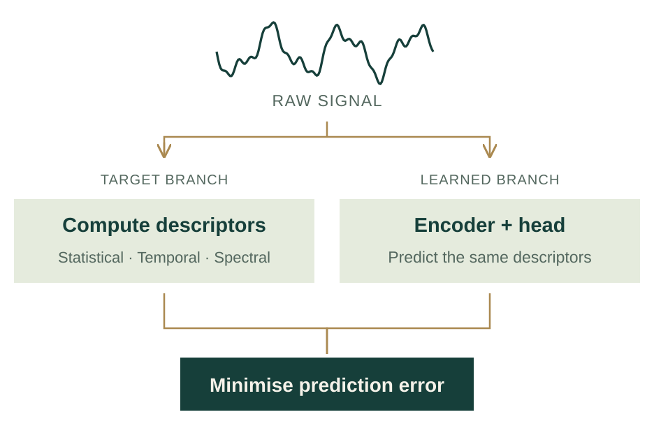
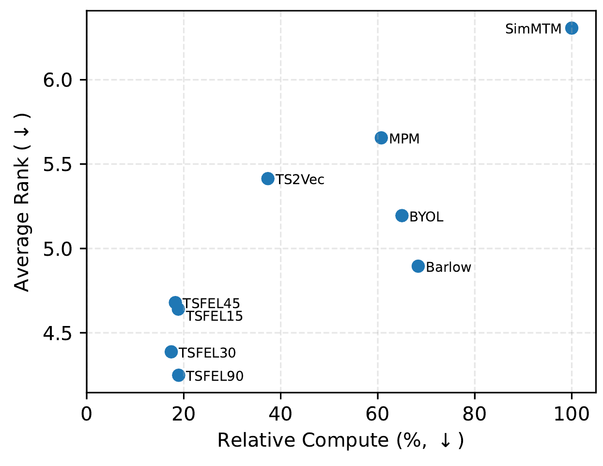
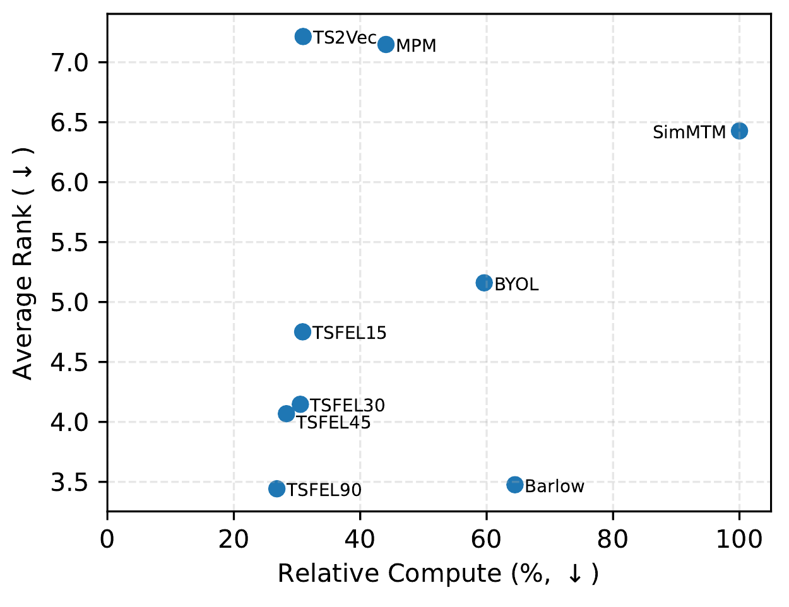

**IEEE DSAA 2026 · Short Presentation**  
Parv Thacker\*, Ayush Shrivastava\*, Nipun Batra  
*Equal contribution.

[Read the paper](signal-descriptors-dsaa2026.pdf){.btn .btn-primary}
[Code](https://github.com/parvthacker/SSL-for-Time-Series){.btn .btn-outline-primary}
[BibTeX](../bibtex/signal-descriptors2026.bib){.btn .btn-outline-primary}

## The problem and the idea

Unlabelled sensor signals already contain structure: their distribution, their variation over time and their frequency content. This work uses statistical, temporal and spectral descriptors as targets for self-supervised pretraining.

A feature extractor computes descriptors from each signal window. An encoder and a prediction head learn to predict these descriptors directly from the raw signal. The resulting representation can then be used for downstream tasks. This pretraining objective does not require signal augmentations or contrastive pairs.

## What was evaluated

The final manuscript describes **1,440 experimental configurations** across two wearable sensing benchmarks, four backbones, two label fractions (5% and 100%), and frozen and unfrozen fine-tuning settings.

- **HHAR:** activity recognition from inertial sensor data.
- **PPG-Dalia:** heart-rate estimation from wearable signals.

Methods are compared using aggregate ranks over configurations. Feature-based supervision is among the strongest approaches on these tasks at lower estimated training compute, measured using network passes. This is not a measurement of total deployment latency or energy use.

## Performance and training compute

The two panels below are reproduced from Figure 2 of the camera-ready paper. Lower-left positions are preferable: better average rank with less estimated training compute. TSFEL labels denote the descriptor-based methods.

::: {.research-figures}
::: {.research-figure}

:::
::: {.research-figure}

:::
:::

## Build on it

The practical takeaway for wearable-sensing researchers is a simple pretraining baseline that is worth testing when labels and compute are limited. The open code supports reproducing and extending the comparison.

> “an effective yet underexplored source of self-supervision”
>
> — Paper abstract, describing time-series descriptors

## Scope

The evaluation covers two wearable datasets and short fixed-length windows. Descriptor choice remains an inductive bias. The results do not establish universal superiority across time-series tasks or show that every learned representation is interpretable.

An earlier version, “Feature-Informed Self-Supervised Learning for Time Series Understanding,” was presented at the MiLeTS workshop at KDD 2026.

[All lab publications](../index.qmd)
